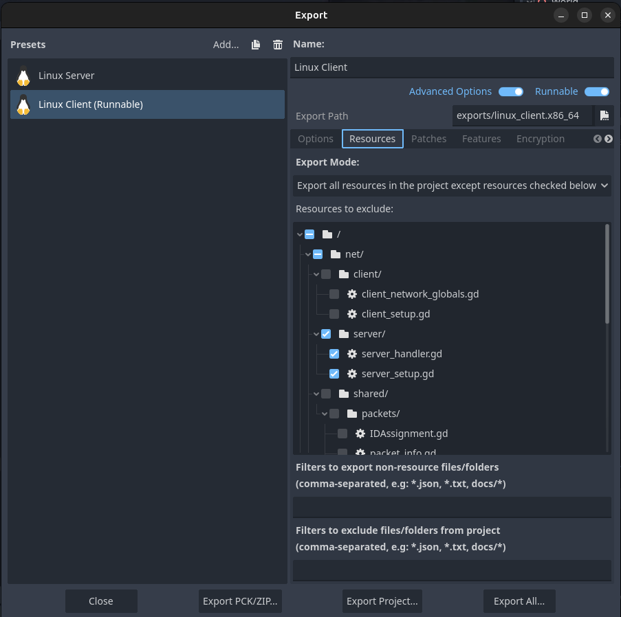
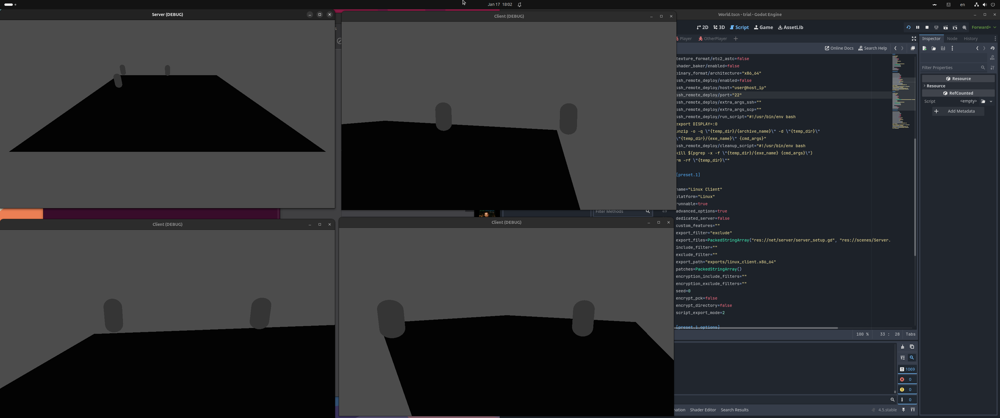

# Godot Low Level Multiplayer implementation
by Franklin Blanco

Godot version 4.5.stable

Following [this amazing tutorial](https://www.youtube.com/watch?v=8GfJw0E5MFE) by IcyEngine, I discovered that it's actually not that hard to make a multiplayer system in godot. But I felt like this video was lacking very important details.

So I decided to make my own take on this coming from a backend dev perspective. Let's begin.

### Problem: Server code inside the client binary
I don't have a problem with this if your players will be hosting their own servers, but for most multiplayer games nowdays, you don't want your players to have the server, much less the code for it. So there needs to be a way to exclude the server code and logic from the game executable. 



You can exclude the server code from the client binary. But this will mean you cannot use autoload for the server code. Resulting in you having to manually add the scripts to your server scene. Kind of clunky but it's what I found works. Then add a launch argument to tell the program which is the server.


```gdscript
func _ready() -> void:
	var args := OS.get_cmdline_args()
	if "--host" in args:
		_run_server()
	else:
		_run_client()

func _run_server() -> void:
	get_window().title = "Server"
	get_tree().call_deferred("change_scene_to_file", "res://scenes/Server.tscn")
```

This way the server code is not included in the client binary.

I had to refactor most things as to get the server logic outside of the implementations of most classes.

### Bug in the video:
I left a comment in IcyEngine's video:

> Amazing video. I was breaking my head with a huge bug, and turns out, for some strange reason, you did a cut and edited a huge crucial detail that adds a big bug. 
At 13:40 you can see line 32 using data.decode_u8, but then you cut and make this data.decode_double? Am I missing something? I changed it back to decode_u8 and all my issues were fixed. But if there's a reason I'd love to know. Anyways, Amazing video once again thanks for the hard work!
IcyEngine replied super fast. Extremely helpful.
> Oh my, thought I had edited that out correctly… anyway, yes you’re right! It should be the “u8”, not the “double”. 

### Conclusions
Finally. I'm not sure if I like how this turned out, I like that it works, it's efficient, and the client binary doesn't contain server code. But there's a few issues. First, the major complexity. But, I assume when you manage everything yourself, it probably is guaranteed to be complex. Second, I dislike a LOT that I have two worlds, and scenes, one for the server and one for the client. Meaning, every implementation has signals everywhere, functions everywhere, and it's very confusing, I would love to have the same implementation for both server and client not what I'm doing right now, calling a singleton for the client and then looking for a server singleton on the server. 
I also don't like that packets get sent from random places in the code. Like, the PlayerMovement script sends the PlayerPosition packet, and that I find just weird.

I must invent or improve a different way to achieve the same outcome. Probably rewrite this whole thing into a very neatly organized structure, with almost the same implementations for server and client, and then have all my signals defined in a global singleton autoloaded. Same for the global variables.



### The rewrite
- [ ] Autoload Single file containing all the neccessary signals only
- [ ] Standarize a way to network
- [ ] 
